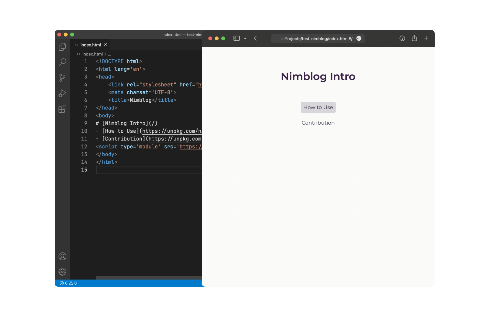

# Nimblog

  

Nimblog requires only a few lines of HTML to deploy and is suitable for lightweight bloggers. The [official side](https://nimblog.vercel.app/) is built with Nimblog, check it out for more information.



* Runs on static website hosting platform, such as [GitHub Pages](https://pages.github.com/).
* Easy to customize themes, as you only need to bring in your own CSS files.
* Use [heti](https://github.com/sivan/heti) to optimize the layout.

I recommend the directory structure below.

```
index.html
your_essay_1.md
your_essay_2.md
your_pic_1.jpg
...
```

Then paste the following content in `index.html`.

```html
<!DOCTYPE html>
<html lang='en'>
<head>
  <link rel="stylesheet" href="https://unpkg.com/nimblog/dist/production/index.css">
  <meta name="viewport" content="width=device-width, initial-scale=1">
  <meta charset='UTF-8'>
  <title>Nimblog</title>
</head>
<body>
# [Your Blog](/)
- [your essay 1](your_essay_1.md)
- [your essay 2](your_essay_2.md)
<script type='module' src='https://unpkg.com/nimblog/dist/production/index.js'></script>
</body>
</html>
```

As you can see, you can write Markdown directly in `<body>` and link to your Markdown documents. Once you're done, just upload this directory to a static website hosting platform.

> **Note**
> Markdown in `<body>` supports any kind of links but only ones ending with `.md` & `.txt` and with `text\markdown` content type are parsed as blog post links under the hood.

## 🔎 Live Preview

Copy & paste code below to edit online with [W3Schools Online Editor](https://www.w3schools.com/tryit/tryit.asp?filename=tryhtml_hello).

```html
<!DOCTYPE html>
<html lang='en'>
<head>
  <link rel="stylesheet" href="https://unpkg.com/nimblog/dist/production/index.css">
  <meta name="viewport" content="width=device-width, initial-scale=1">
  <meta charset='UTF-8'>
  <title>Nimblog</title>
</head>
<body>
# [Nimblog Intro](/)
- [How to Use](https://unpkg.com/nimblog/dist/production/how-to-use.md)
- [Contribution](https://unpkg.com/nimblog/dist/production/contribution.md)
<script type='module' src='https://unpkg.com/nimblog/dist/production/index.js'></script>
</body>
</html>
```

> **Note**
> If you want to try it in other online editor like StackBlitz, make sure to turn off prettier or formatter so that Markdown content in HTML will not be destructed. 

## 🧪 Contribution

Feel free to contribute to Nimblog. Visit [official guide contribution page](https://nimblog.vercel.app/#/contribution).
